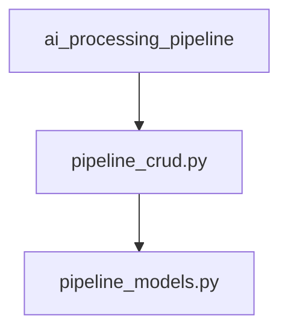

## Pipeline 시스템에 DB 도입 이유 및 구성 방안
### 도입 목적
- 파이프라인 실행을 병렬 처리하고자 함
- Amazon SQS 기반 워커 모델을 사용하여 job 단위로 분산 처리
- 각 파이프라인 실행 및 단계별 결과를 DB에 영속화하여 관리 및 추적 가능하게 함

### 파이프라인 ID 정책
- 현재 사용하는 UUID 기반 ID 유지
- 각 파이프라인 실행(PipelineExecution)과 단계(PipelineStep)는 UUID 기반으로 추적
- 별도의 job 단위 ID는 불필요

### 데이터베이스 구성
#### db/ 디렉토리
1. pipeline_models.py
- SQLAlchemy 기반으로 아래 모델 정의
- PipelineExecution: 파이프라인 전체 실행 단위
- PipelineStep: 파이프라인의 각 단계별 정보
- PipelineFile: 각 단계의 입출력 파일 및 결과물 저장

2. pipeline_crud.py
- DB CRUD 로직 정의
- pipeline_models에 의존하여 ORM 모델에 대한 조작 수행

### 실행 흐름 및 의존 구조

- ai_processing_pipeline: 실제 파이프라인 로직 구현, 단계 실행 중간중간 DB에 상태, 출력 등 저장
- pipeline_crud.py: DB 접근 및 저장 로직 담당
- pipeline_models.py: 테이블 스키마 정의 (CRUD의 대상)

### 저장 항목
- Execution 단위로 실행 시작/종료 시각, 상태, 구성 정보 등 기록
- Step 단위로 실행 상태, 처리 시간, 입출력 데이터, 에러 메시지 등 기록
- File 단위로 각 단계의 결과 파일 저장 (텍스트, 바이너리 포함)

### 기대 효과
- 병렬 분산 처리 가능 (SQS 기반 워커가 UUID 기반으로 job 실행)
- 파이프라인 실행 전체 이력 및 결과 추적 가능
- 장애 발생 시 재시도 및 분석 용이
- 파일 및 메타데이터까지 통합적으로 관리 가능

